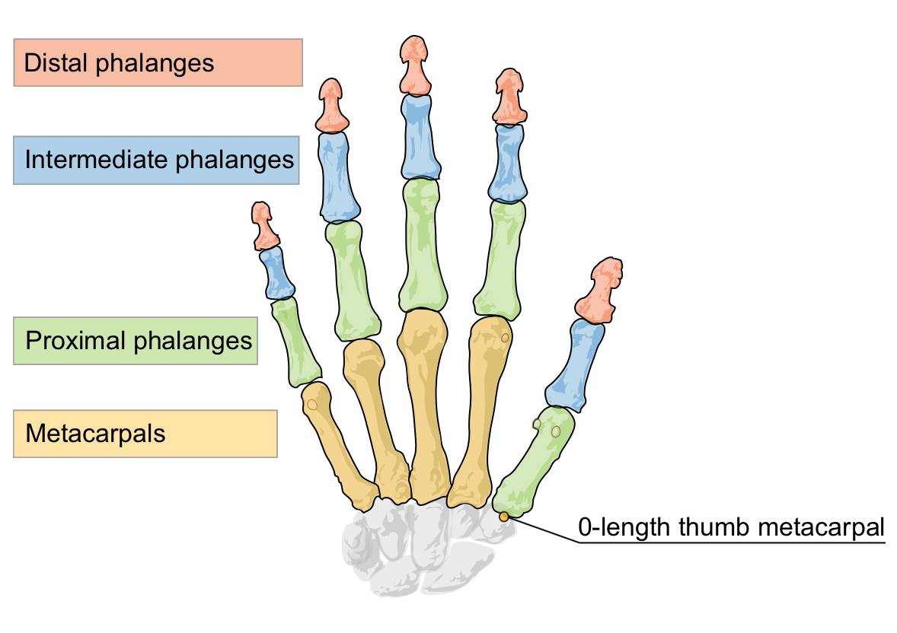

# LeapMotion 2 技术文档 By WangLe1_

## LeapMotion2 工作原理

LeapMotion 控制器包含硬件和软件两个部分

### 硬件部分

LeapMotion 是一种检测和跟踪手、手指及类似手指物品的工具。设备会对近距离的手或者手指进行高帧率高精度的跟踪，并提供离散的位置、手势及动作信息。

LeapMotion 控制器使用光学传感器和红外线。Leap可以检测当控制器处于与panel选中的相符的位置时，沿 Y 轴向上处于控制器位置大约 160 度的视野。LeapMotion 的有效范围在处于设备上方时从大约 10 毫米到 600 毫米不等。（我自己粗测的）
当被追踪物体具有清晰、高对比度的轮廓时，传感器的检测和追踪能达到最佳工作状态。LeapMotion 软件结合传感器数据和其内建的人手模型来解决检测和追踪时的问题。

LeapMotion 硬件部分包含了一对立体红外相机和 LED 照明灯。相机传感器在设备处于标准位置时朝上。下图展示了LeapMotion如何监视一个用户的手:

 
leapview

## 软件部分

LeapMotion 的软件部分则负责接收传感器的数据并分析这些与手、手指、手臂、工具的数据（追踪其他类型的物体特性会在以后被添加，目前这些就是全部能够被追踪的集合）。 软件包含一个手的内部模型和收到的传感器数据进行对比来确定最佳匹配。传感器数据以帧为单位，将每一帧数据发送给支持 LeapMotion 的应用。 你的程序接收到 Frame 对象包含了**全部的已知位置、向量及全部追踪的到的特点**，比如手、手指、工具等。类似手势、动作这种横跨多个帧的数据同样会在每帧被更新。

## 坐标系

LeapMotion 使用一个右手笛卡尔坐标系，它的原点位于 LeapMotion 控制器的顶面中心点，X 轴与 Z 轴位于水平面，其中 X 轴与控制器的长边平行。Y轴垂直向上为正方向（这与绝大多数计算机图形系统的坐标轴是相反的，它们的正方向向下）。Z 轴的方向指向用户所处的位置。

 
LeapMotion的坐标系 
其中z负方向为其电源插口方向

### 所测物理量

LeapMotion API 测量的物理量如下：

距离 - 毫米

时间 - 微秒（除非有特别说明）

速度 - 毫米/秒

角度 - 弧度

## 动作追踪数据

当 LeapMotion 控制器在视野范围内追踪内追踪手、手指和工具时，它以帧为单位更新一套数据。每个 `Frame` 对象代表一帧，其中包含检测的实体序列，比如手、手指、工具以及识别到的手势和描述场景中整体动作的因素。`Frame` 对象是 LeapMotion 数据模型的基础。

### 手部

手模型提供了手部的各种信息，包括手的识别、位置及其他特征的检测，手部所连接手臂，以及手上的手指序列。

 手的 ``palm_normal`` 和 ``direction`` 向量定义了手的朝向

LeapMotion 软件使用人的手部模型来提供可预测的追踪，即便当手仅仅只是部分可见时。手模型始终会给出五个手指的位置，但是只有在手和手指的轮廓是清晰可见时才能达到最佳效果。软件利用了手的可见部分、它的内建模型以及历史观测信息来计算不可见部分最有可能的位置信息。值得一提的是，手指的细微动作对于 LeapMotion 传感器来说可能不太能够被检测到。

当每帧中存在不只一人的手或者类似手的物体时，手序列也可以出现超过两只手的对象，然而为了达到最佳的追踪效果，我们建议最多只让两只手出现在视野内比较合适。

### 手臂

手臂是骨骼类似物对象，它包括其指向、长度、宽度、手臂的端点。当肘部不在视野中时，LeapMotion 控制器会基于历史数据及人体参数来估计它出现的位置。

### 手指

LeapMotion 控制器可以给出一只手上每一根手指的数据。如果某个手指的部分或者全部不可见，那么这根手指的特性同样会基于历史数据进行估计。手指通过名字来进行标识，即：`thumb`(大拇指)，`index`(食指)，`middle`(中指)，`ring`(无名指) 以及 `pinky`(小拇指)。

手指利用 `Finger`类对象进行刻画，是一种 Pointable(可指向) 对象。

 
手指的`tip_position`和`direction`向量来表明指尖的位置和手指指向的大致方向

#### 骨头

一个 `Finger` 对象包含了一个 `Bone` 对象，用于描述每个手指上的每个解剖学上的骨头位置和指向。

骨头分别是:

- Metacarpal

– the bone inside the hand connecting the finger to the wrist (except the thumb)

- Proximal Phalanx

– the bone at the base of the finger, connected to the palm

- Intermediate Phalanx

– the middle bone of the finger, between the tip and the base

- Distal Phalanx

– the terminal bone at the end of the finger

这个模型中的大拇指和标准解剖模型的命名不同。真实的大拇指比其他手指少一根骨头。但是为了编程的方便，LeapMotion 模型中的大拇指包含了一个长度为 0 的 Metacarpals，以便大拇指的骨头索引与其他手指相同。这样导致的结果是 在LeapMotion 模型中，大拇指的解剖学 Metacarpal 骨名被标注为 Proximal Phalanx，而解剖学上的 Proximal Phalanx 被标注为 Intermediate Phalanx。

（原始图形见：[Marianna Villareal](https://commons.wikimedia.org/wiki/File:Scheme_human_hand_bones-en.svg)）

## 手势

LeapMotion 软件能够识别特定运动模式的手势来表达用户的意图或者指令。每个手势都能对手指或工具都进行独立观测。LeapMotion 会如同返回其他运动追踪数据（比如手、手指）一样在每一帧里返回手势的检测信息。

下面的运动模式能够被 LeapMotion 软件识别：

 
Circle — 手指画圈
 
Swipe — 一个手或手指的长距离线性移动 
 
Key Tap — 手指像敲击键盘一样的点击移动模式 
 
Screen Tap — 想垂直点击屏幕一样的点击移动模式

*注意*🚀️
在你的应用程序中使用手势之前，你必须确保你要用的每一个手势都能够被识别。你需要使用 `Controller` 类中的 `enableGesture()` 方法使你想用的手势被识别到。

## 动作

用户手部在某一段时间内的变化被定义为基本的动作种类，运动就是根据这些基本的动作种类被估计出来的。运动包括缩放、旋转、位移（位置变化）。

运动是在两帧之间被计算出来的。你可以从一个 `Frame` 对象里获得一个场景的全部运动因子。也可以从一个 `Hand` 对象里获得与单独一只手有关的运动因子。

你可以用返回的运动因子来为你的应用设计交互方式。比如，你可以计算两帧之间的缩放因素来让用户改变物体的大小，而不是很多帧的数据来追踪每一个手指的位置变化。

|运动类型|帧|手|
|-|-|-|
|Scale(缩放)|帧的缩放反映了场景物体之间的靠近或远离的运动|手的缩放则反应了手指的开合变化。|
|Rotation(旋转)|帧的旋转反映了场景内物体的运动差异。例如一只手抬起而另一只则放下|手的旋转反应了一只手朝向的变化情况。|
|Translation(平移)|帧的平移反映了场景内所有物体的平均位置变化。比如两只手都同时向左、上、前方移动。|手的平移反应了手的位置变化。|

